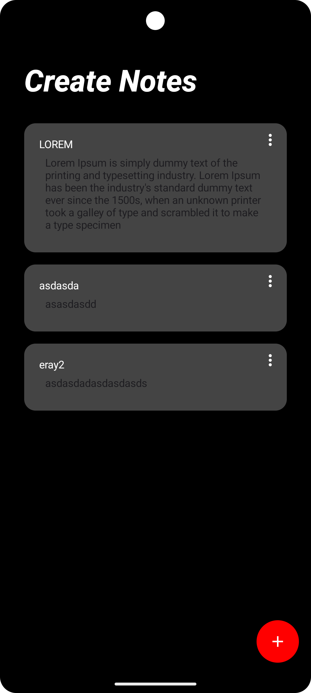
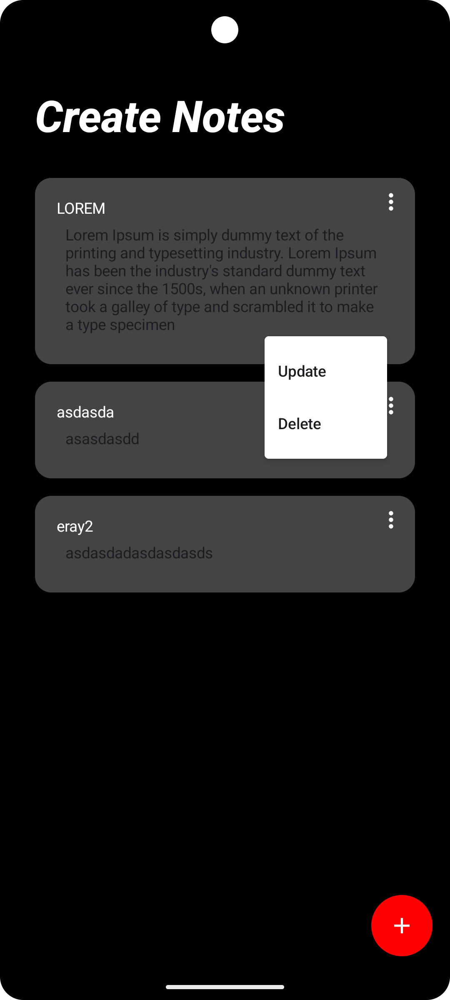

# Not Defteri (Notes App)

Modern ve kullanıcı dostu bir not alma uygulaması. Firebase Firestore kullanarak notlarınızı bulut üzerinde saklayın ve her yerden erişin.

## Özellikler

- 📝 Not oluşturma
- ✏️ Not güncelleme
- 🗑️ Not silme
- ☁️ Firebase ile bulut depolama
- 🎨 Modern Material Design 3 arayüzü
- 🌙 Koyu tema
- 📱 Jetpack Compose ile modern UI

## Teknolojiler

- Kotlin
- Jetpack Compose
- Firebase Firestore
- MVVM Mimarisi
- Coroutines
- Flow
- Material Design 3


## Ekran Görüntüleri

### Ana Ekran

*Notların listelendiği ana ekran*

### Not Ekleme

*Yeni not ekleme ekranı*

### Not Güncelleme

*Not güncelleme ekranı*

## Kullanım

1. Ana ekranda sağ alt köşedeki + butonuna tıklayarak yeni not ekleyin
2. Notları güncellemek için notun sağ üst köşesindeki menü ikonuna tıklayın ve "Update" seçeneğini seçin
3. Notları silmek için notun sağ üst köşesindeki menü ikonuna tıklayın ve "Delete" seçeneğini seçin

## Proje Yapısı

```
app/
├── src/
│   ├── main/
│   │   ├── java/com/example/notdefteri/
│   │   │   ├── models/
│   │   │   │   └── Notes.kt
│   │   │   ├── repository/
│   │   │   │   └── NoteRepository.kt
│   │   │   ├── Screens/
│   │   │   │   ├── notescreen/
│   │   │   │   │   ├── NotesScreen.kt
│   │   │   │   │   └── ListItems.kt
│   │   │   │   └── insertnotesscreen/
│   │   │   │       └── InsertNotesScreen.kt
│   │   │   ├── viewmodel/
│   │   │   │   └── NotesScreenViewModel.kt
│   │   │   └── MainActivity.kt
│   │   └── res/
│   │       └── values/
│   │           └── strings.xml
│   └── test/
└── build.gradle.kts
```

## Katkıda Bulunma

1. Bu depoyu fork edin
2. Yeni bir branch oluşturun (`git checkout -b feature/amazing-feature`)
3. Değişikliklerinizi commit edin (`git commit -m 'Add some amazing feature'`)
4. Branch'inizi push edin (`git push origin feature/amazing-feature`)
5. Bir Pull Request oluşturun

## Lisans

Bu proje MIT lisansı altında lisanslanmıştır. Detaylar için [LICENSE](LICENSE) dosyasına bakın.

